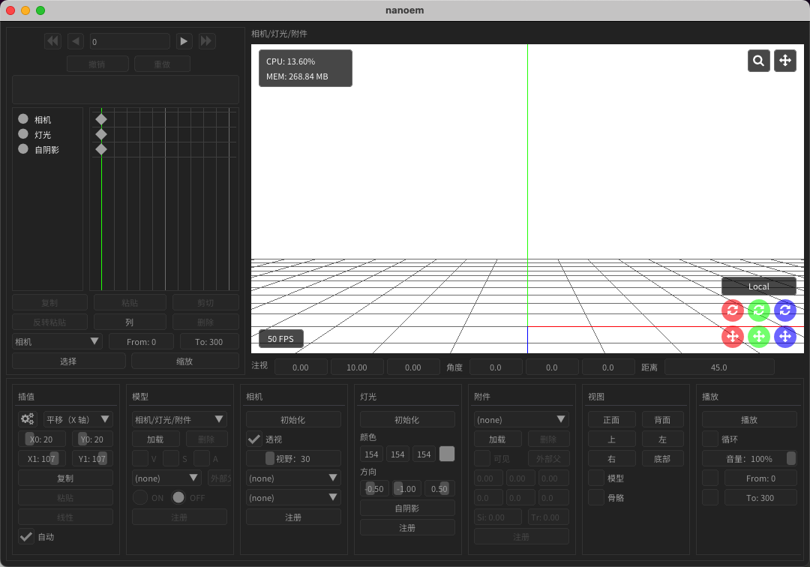

# nanoem-cn

[](https://opensource.org/licenses/MPL-2.0)
[](https://opensource.org/licenses/MIT)


**nanoem-cn** 是 [nanoem](https://github.com/hkrn/nanoem) 的社区维护中文分支，提供完整的简体中文界面与文档。

nanoem 是一款跨平台的开源 [MMD（MikuMikuDance）](https://sites.google.com/view/vpvp/) 兼容软件，原生支持 macOS，也可运行于 Windows，支持编辑和播放 VMD/PMX/PMD 格式的模型动画。

> 🌐 **English**: nanoem-cn is a community-maintained Chinese fork of [nanoem](https://github.com/hkrn/nanoem), a cross-platform open-source [MMD (MikuMikuDance)](https://sites.google.com/view/vpvp/) compatible application. It features a fully translated Chinese UI and documentation.

## 特性

| 类别 | 说明 |
|------|------|
| 🌏 **简体中文界面** | 1180+ 条 UI 翻译，菜单、对话框、提示信息全汉化 |
| 📖 **简体中文文档** | 使用手册全文汉化（Sphinx + Read the Docs 主题） |
| 📂 **内置离线文档** | 软件内直接打开使用手册，无需联网 |
| 🎨 **中文字体优化** | 内置 Noto Sans SC 字体，中日文字形统一，显示美观 |
| 🖥️ **Universal Binary** | macOS 版本同时支持 Intel 和 Apple Silicon |
| 🪟 **Windows 兼容** | 支持 Windows 10+ 运行（DirectX11 / OpenGL） |
| 🎬 **多格式支持** | VMD 动作、PMX/PMD 模型、PMM 项目文件 |
| ✏️ **模型编辑** | 类似 PMXEditor 的骨骼、表情、材质编辑功能 |
| 🎮 **多图形后端** | Metal / DirectX11 / OpenGL |

## 版本号说明

本分支版本号沿用上游 nanoem 版本号，加 `-cn` 后缀以示区别。

例如 `v34.10.0-cn1` 表示基于上游 v34.10.0 的第一个中文版本。上游发布新版本后，本分支会跟进合并并递增 `-cn` 序号。

## 与上游的差异

- 简体中文界面与文档翻译
- 内置离线文档（帮助菜单直接打开本地 HTML）
- 中文字体替换（Noto Sans SC），移除日文字体回退
- Windows 子窗口点击修复（进行中）
- Windows DPI 缩放适配（进行中）

## 截图



## 下载

请前往 [Releases](https://github.com/BesingBG/nanoem-cn/releases) 页面下载最新版本。

## 构建

### 前置要求

- [cmake](https://cmake.org)（>= 3.5）
- C++14 兼容编译器（Clang / Visual Studio 2017+）
- [git](https://git-scm.com)
- [ninja-build](https://ninja-build.org/)（macOS/Linux 推荐）
- **Windows**: Windows 10 22H2+（build 19045，实测可用）。更早版本可能存在鼠标交互问题，详见 [KNOWN_ISSUES.md](KNOWN_ISSUES.md)。

### 构建步骤

```bash
git submodule update --init --recursive

# macOS（Apple Clang）
export NANOEM_TARGET_COMPILER=clang
cmake -P scripts/build.cmake
mkdir out && cd out
cmake -G Ninja ..
cmake --build .
```

详细信息请参考 [GitHub Action Workflow](.github/workflows/main.yml) 或原项目文档。

## 已知问题

详见 [KNOWN_ISSUES.md](KNOWN_ISSUES.md)。

## 交流群

QQ交流群：1077765705


## 许可证

- nanoem 组件： [MIT/X11 License](LICENSE.MIT)
- emapp / macos / win32 / glfw / sapp 组件：[Mozilla Public License](LICENSE.MPL)

## 致谢

感谢 [hkrn](https://github.com/hkrn) 创建并维护了优秀的 nanoem 项目。
